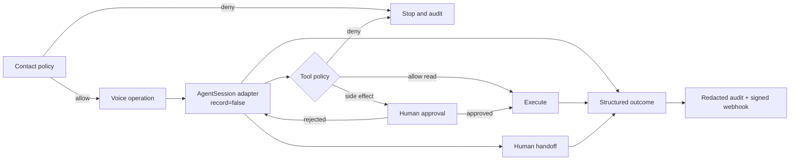

# Avrixo VoiceOps

> **Modified fork notice:** This repository is a public fork of
> [LiveKit Agents](https://github.com/livekit/agents). The inherited framework, history,
> copyrights, licenses, and notices remain LiveKit's and their respective authors'. Avrixo's
> separately identified contribution is the governed voice-operations layer documented below.

Avrixo VoiceOps is an engineering reference for policy-controlled realtime AI voice operations.
It adds an explicit session lifecycle, consent-aware contact policy, governed tools, operator
approvals, human handoff, redacted transcripts, structured outcomes, signed webhooks, bounded
retries, operational metrics, deterministic providers, and offline-safe tests around the
inherited LiveKit Agents runtime.

This is not a claim of regulatory certification, production call volume, customer adoption,
telephony success rates, or measured production latency. Recording is disabled by default.

## Governance flow



## Avrixo-specific package

The new implementation lives in [`avrixo-voice-ops/`](avrixo-voice-ops/). Its runtime uses only
the Python standard library so policy decisions and tests do not require LiveKit Cloud, phone
calls, SIP trunks, or paid STT, LLM, and TTS providers.

```bash
cd avrixo-voice-ops
uv sync --extra dev
uv run pytest
uv run python scripts/run_evaluations.py
```

The optional `LiveKitSessionAdapter` imports the inherited `AgentSession` only at deployment time,
passes provider instances through, and explicitly sets `record=False`. SIP creation and transfer
remain delegated to the inherited `JobContext` integration points after Avrixo policy approval.

## Design boundaries

- The model cannot authorize its own side effects.
- Unlisted and restricted tools fail closed.
- Every side effect requires explicit human approval and an idempotency key.
- Webhooks require HTTPS, HMAC-SHA256 signatures, stable idempotency keys, and at most three tries.
- Secrets, authentication codes, cards, and configured personal data are redacted before audit.
- Post-call summaries use only stored, already-redacted session evidence.
- Transcript retention is opt-in; recording requires an explicit consent confirmation.
- No separately licensed model asset is modified or used by the deterministic test suite.

See [architecture](docs/architecture.md), [security](docs/security.md),
[development](docs/development.md), [upstream provenance](UPSTREAM.md), and
[fork changes](FORK_CHANGES.md).

## Inherited LiveKit Agents

The rest of this repository is the inherited LiveKit Agents framework, including its Agent,
AgentSession, worker/job lifecycle, provider interfaces, SIP integration, metrics, plugins,
examples, and tests. Avrixo does not claim authorship of those components. Refer to the
[upstream repository](https://github.com/livekit/agents) and
[LiveKit Agents documentation](https://docs.livekit.io/agents/) for their usage and support.

## License and notices

The inherited root [`LICENSE`](LICENSE), [`NOTICE`](NOTICE), [`MODEL_LICENSE`](MODEL_LICENSE), and
[`livekit-agents/livekit/agents/resources/NOTICE`](livekit-agents/livekit/agents/resources/NOTICE)
are preserved. The Avrixo additions are distributed under the repository's Apache-2.0 terms.
Separately licensed model assets remain subject to `MODEL_LICENSE` and are not modified here.
