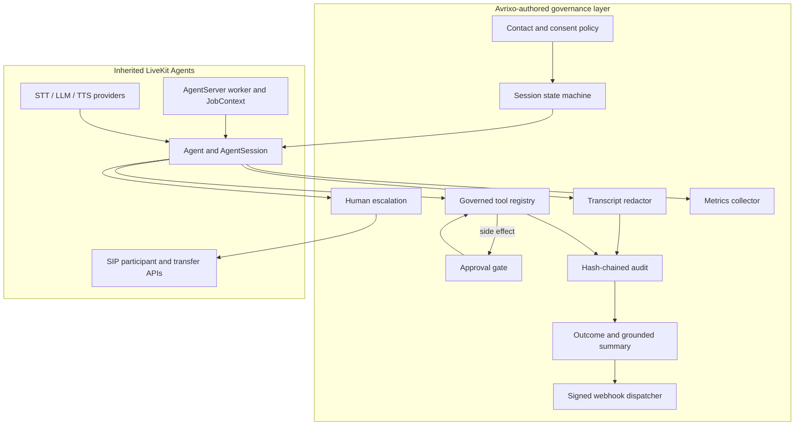
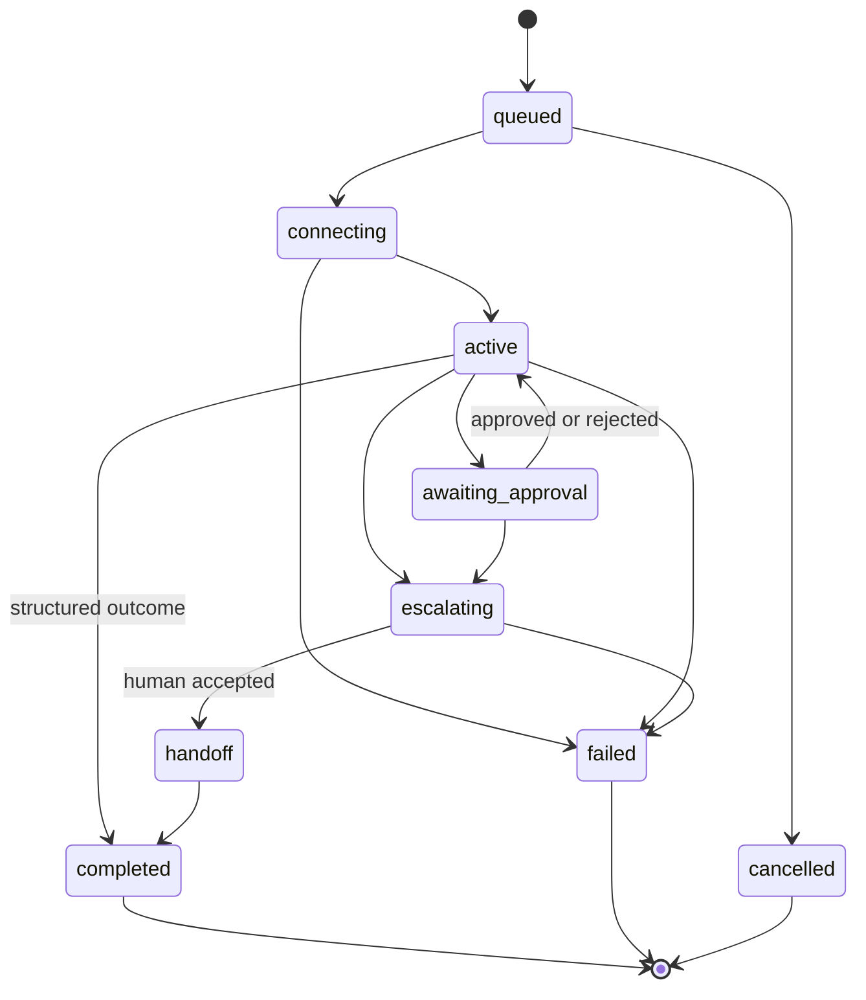

# Architecture

Avrixo VoiceOps is a governance layer around the inherited LiveKit Agents runtime. Its core is
provider-neutral and synchronous by design, making every policy path deterministic. Deployments
adapt these decisions to LiveKit `AgentSession`, `JobContext`, SIP, and provider objects.

## Session lifecycle

Invalid transitions raise an error. A model response cannot mutate state directly; the controller
owns transitions and records governance events in the audit chain.

## Runtime sequence

1. `ContactPolicyEngine` evaluates direction, consent, do-not-contact status, retry ceiling, local
   calling window, and maximum session duration.
2. `VoiceOpsController` creates an operation and advances a session through `queued`, `connecting`,
   and `active`.
3. The injected STT, LLM, TTS, and telephony providers run behind narrow protocols. Test providers
   are deterministic and make no network call.
4. `ToolPolicyEngine` returns exactly `allow`, `deny`, or `requires_approval`. Unlisted tools deny.
5. Side effects additionally require an idempotency key. The approval record is scoped to the
   session and invocation and cannot be self-approved by the model.
6. Escalation advances the session to `escalating`, then `handoff` or `failed` based on an injected
   human/telephony adapter.
7. Completion records an explicit outcome. `GroundedSummaryBuilder` uses only redacted turns,
   executed tools, the outcome, duration, and escalation state; it cannot add external facts.
8. The webhook boundary canonicalizes and redacts JSON, signs it, retries no more than three times,
   and deduplicates by idempotency key.

## Data model

| Record | Important fields |
| --- | --- |
| `VoiceOperation` | direction, purpose, policy profile, contact reference, status |
| `VoiceSession` | operation ID, lifecycle state, timestamps, provider labels, disconnect/failure |
| `ConversationTurn` | sequence, speaker, redacted transcript, confidence, redaction state |
| `ToolInvocation` | policy decision, approval ID, attempts, idempotency key, sanitized error |
| `ApprovalDecision` | invocation scope, status, operator, reason, timestamps |
| `EscalationRequest` | reason, destination, status, accepted timestamp, result |
| `CallOutcome` | classification, confidence, disposition, follow-up flag, notes |
| `PostCallSummary` | evidence facts, actions, escalation, duration, transcript hash reference |
| `SessionMetrics` | component latencies, first response, turns, tools, retries, provider labels |

The reference stores are process-local to keep the project runnable offline. Production adapters
must provide durable, access-controlled approval, audit, transcript, outcome, idempotency, and
webhook-delivery stores without weakening these contracts.

See [security](security.md), [development](development.md), and
[upstream provenance](../UPSTREAM.md).
